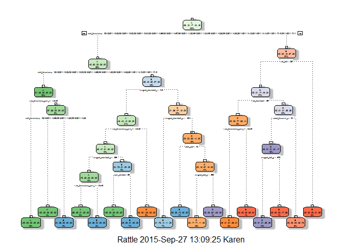
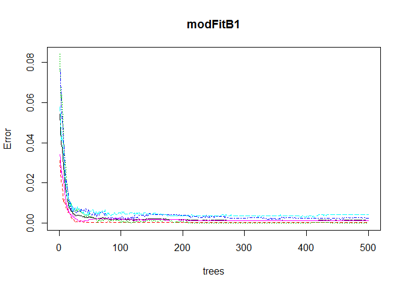
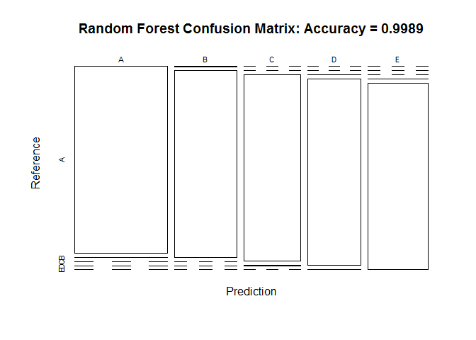
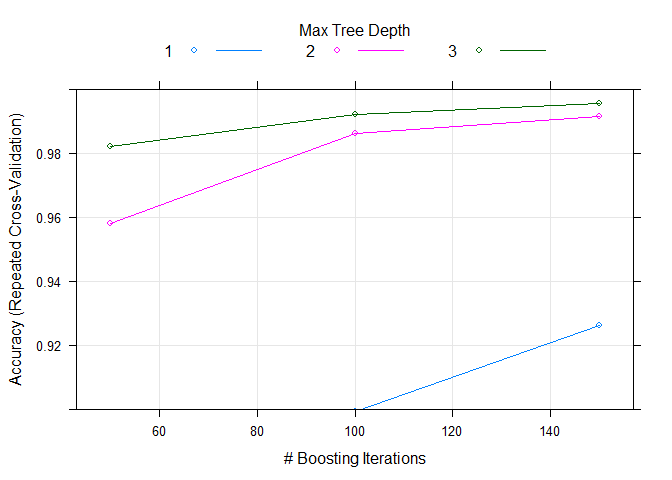

# Final Project Report - Practical Machine Learning Course
Karen Linden  
Saturday, September 26, 2015  


##Reproduceablity
In order to reproduce the same results, you need a certain set of packages, as well as setting a pseudo random seed equal to the one I used. 
The following Libraries were used for this project, which you should install - if not done yet - and load on your working environment.


```r
setwd('~/R/PracticalMachineLearning')

library(lattice)
library(ggplot2)
library(RGtk2)
library(splines)
library(survival)
library(plyr)
library(parallel)
library(caret)
```

```
## 
## Attaching package: 'caret'
## 
## The following object is masked from 'package:survival':
## 
##     cluster
```

```r
library(rpart)
library(rpart.plot)
library(RColorBrewer)
library(rattle)
```

```
## Rattle: A free graphical interface for data mining with R.
## Version 3.5.0 Copyright (c) 2006-2015 Togaware Pty Ltd.
## Type 'rattle()' to shake, rattle, and roll your data.
```

```r
library(randomForest)
```

```
## randomForest 4.6-10
## Type rfNews() to see new features/changes/bug fixes.
```

```r
library(gbm)
```

```
## Loaded gbm 2.1.1
```

Finally, load the same seed with the following line of code:


```r
set.seed(12345)
```

##Getting and loading the data


```r
trnUrl <- "http://d396qusza40orc.cloudfront.net/predmachlearn/pml-training.csv"
tstUrl <- "http://d396qusza40orc.cloudfront.net/predmachlearn/pml-testing.csv"

training <- read.csv(url(trnUrl), na.strings=c("NA","#DIV/0!",""))
testing <- read.csv(url(tstUrl), na.strings=c("NA","#DIV/0!",""))
```
Partioning the training set into two


```r
inTrn <- createDataPartition(training$classe, p=0.6, list=FALSE)
Train<- training[inTrn, ]
Test <- training[-inTrn, ]
dim(Train); dim(Test)
```

```
## [1] 11776   160
```

```
## [1] 7846  160
```

##Cleaning the data

Cleaning NearZeroVariance Variables Run this code to view possible NZV Variables:


```r
DataNZV <- nearZeroVar(Train, saveMetrics=TRUE)
Train <- Train[,DataNZV$nzv==FALSE]
```

Remove the first column of the myTraining data set

```r
Train <- Train[c(-1)]
```

Clean variables with more than 60% NA

```r
train2 <- Train 
for(i in 1:length(Train)) {
    if( sum( is.na(Train[, i] ) ) /nrow(Train) >= .7) {
        for(j in 1:length(train2)) {
            if( length( grep(names(Train[i]), names(train2)[j]) ) == 1)  {
                train2 <- train2[ , -j]
            }   
        } 
    }
}

Train <- train2
rm(train2)
```
Now let us do transformations but for our myTesting and testing data sets.

```r
c1 <- colnames(Train)
c2 <- colnames(Train[, -58])  
Test<- Test[c1]        
testing <- testing[c2]           

dim(Test)
```

```
## [1] 7846   58
```

```r
dim(testing)
```

```
## [1] 20 57
```

In order to ensure proper functioning of Decision Trees and especially RandomForest Algorithm with the Test data set (data set provided), we need to coerce the data into the same type.


```r
for (i in 1:length(testing) ) {
    for(j in 1:length(Train)) {
        if( length( grep(names(Train[i]), names(testing)[j]) ) == 1)  {
            class(testing[j]) <- class(Train[i])
        }      
    }      
}

testing <- rbind(Train[2, -58] , testing) 
testing <- testing[-1,]
```

##Prediction with Decision Trees

```r
set.seed(12345)
modFitA1 <- rpart(classe ~ ., data=Train, method="class")
fancyRpartPlot(modFitA1)
```

 

```r
predictionsA1 <- predict(modFitA1, Test, type = "class")
cmtree <- confusionMatrix(predictionsA1, Test$classe)
cmtree
```

```
## Confusion Matrix and Statistics
## 
##           Reference
## Prediction    A    B    C    D    E
##          A 2150   60    7    1    0
##          B   61 1260   69   64    0
##          C   21  188 1269  143    4
##          D    0   10   14  857   78
##          E    0    0    9  221 1360
## 
## Overall Statistics
##                                           
##                Accuracy : 0.8789          
##                  95% CI : (0.8715, 0.8861)
##     No Information Rate : 0.2845          
##     P-Value [Acc > NIR] : < 2.2e-16       
##                                           
##                   Kappa : 0.8468          
##  Mcnemar's Test P-Value : NA              
## 
## Statistics by Class:
## 
##                      Class: A Class: B Class: C Class: D Class: E
## Sensitivity            0.9633   0.8300   0.9276   0.6664   0.9431
## Specificity            0.9879   0.9693   0.9450   0.9845   0.9641
## Pos Pred Value         0.9693   0.8666   0.7809   0.8936   0.8553
## Neg Pred Value         0.9854   0.9596   0.9841   0.9377   0.9869
## Prevalence             0.2845   0.1935   0.1744   0.1639   0.1838
## Detection Rate         0.2740   0.1606   0.1617   0.1092   0.1733
## Detection Prevalence   0.2827   0.1853   0.2071   0.1222   0.2027
## Balanced Accuracy      0.9756   0.8997   0.9363   0.8254   0.9536
```

##Prediction with Random Forests

```r
set.seed(12345)
modFitB1 <- randomForest(classe ~ ., data=Train)
predictionB1 <- predict(modFitB1, Test, type = "class")
cmrf <- confusionMatrix(predictionB1, Test$classe)
cmrf
```

```
## Confusion Matrix and Statistics
## 
##           Reference
## Prediction    A    B    C    D    E
##          A 2231    2    0    0    0
##          B    1 1516    0    0    0
##          C    0    0 1367    3    0
##          D    0    0    1 1282    1
##          E    0    0    0    1 1441
## 
## Overall Statistics
##                                           
##                Accuracy : 0.9989          
##                  95% CI : (0.9978, 0.9995)
##     No Information Rate : 0.2845          
##     P-Value [Acc > NIR] : < 2.2e-16       
##                                           
##                   Kappa : 0.9985          
##  Mcnemar's Test P-Value : NA              
## 
## Statistics by Class:
## 
##                      Class: A Class: B Class: C Class: D Class: E
## Sensitivity            0.9996   0.9987   0.9993   0.9969   0.9993
## Specificity            0.9996   0.9998   0.9995   0.9997   0.9998
## Pos Pred Value         0.9991   0.9993   0.9978   0.9984   0.9993
## Neg Pred Value         0.9998   0.9997   0.9998   0.9994   0.9998
## Prevalence             0.2845   0.1935   0.1744   0.1639   0.1838
## Detection Rate         0.2843   0.1932   0.1742   0.1634   0.1837
## Detection Prevalence   0.2846   0.1933   0.1746   0.1637   0.1838
## Balanced Accuracy      0.9996   0.9993   0.9994   0.9983   0.9996
```

```r
plot(modFitB1)
```

 

```r
plot(cmrf$table, col = cmtree$byClass, main = paste("Random Forest Confusion Matrix: Accuracy =", round(cmrf$overall['Accuracy'], 4)))
```

 


##Prediction with Generalized Boosted Regression

```r
set.seed(12345)
fitControl <- trainControl(method = "repeatedcv",
                           number = 5,
                           repeats = 1)

gbmFit1 <- train(classe ~ ., data=Train, method = "gbm",
                 trControl = fitControl,
                 verbose = FALSE)


gbmFinMod1 <- gbmFit1$finalModel

gbmPredTest <- predict(gbmFit1, newdata=Test)
gbmAccuracyTest <- confusionMatrix(gbmPredTest, Test$classe)
gbmAccuracyTest
```

```
## Confusion Matrix and Statistics
## 
##           Reference
## Prediction    A    B    C    D    E
##          A 2230    4    0    0    0
##          B    2 1509    1    0    0
##          C    0    4 1361    3    0
##          D    0    1    6 1274    1
##          E    0    0    0    9 1441
## 
## Overall Statistics
##                                           
##                Accuracy : 0.996           
##                  95% CI : (0.9944, 0.9973)
##     No Information Rate : 0.2845          
##     P-Value [Acc > NIR] : < 2.2e-16       
##                                           
##                   Kappa : 0.995           
##  Mcnemar's Test P-Value : NA              
## 
## Statistics by Class:
## 
##                      Class: A Class: B Class: C Class: D Class: E
## Sensitivity            0.9991   0.9941   0.9949   0.9907   0.9993
## Specificity            0.9993   0.9995   0.9989   0.9988   0.9986
## Pos Pred Value         0.9982   0.9980   0.9949   0.9938   0.9938
## Neg Pred Value         0.9996   0.9986   0.9989   0.9982   0.9998
## Prevalence             0.2845   0.1935   0.1744   0.1639   0.1838
## Detection Rate         0.2842   0.1923   0.1735   0.1624   0.1837
## Detection Prevalence   0.2847   0.1927   0.1744   0.1634   0.1848
## Balanced Accuracy      0.9992   0.9968   0.9969   0.9947   0.9990
```

```r
plot(gbmFit1, ylim=c(0.9, 1))
```

 
##Predicting Results on the Test Data
Random Forests gave an Accuracy in the Test dataset of 99.89%, which was more accurate that what I got from the Decision Trees or GBM. The expected out-of-sample error is 100-99.89 = 0.11%.

```r
predictionB2 <- predict(modFitB1, testing, type = "class")
predictionB2
```

```
##  2 31  4  5  6  7  8  9 10 11 12 13 14 15 16 17 18 19 20 21 
##  B  A  B  A  A  E  D  B  A  A  B  C  B  A  E  E  A  B  B  B 
## Levels: A B C D E
```

```r
pml_write_files = function(x){
    n = length(x)
    for(i in 1:n){
        filename = paste0("problem_id_",i,".txt")
        write.table(x[i],file=filename,quote=FALSE,row.names=FALSE,col.names=FALSE)
    }
}

pml_write_files(predictionB2)
```


